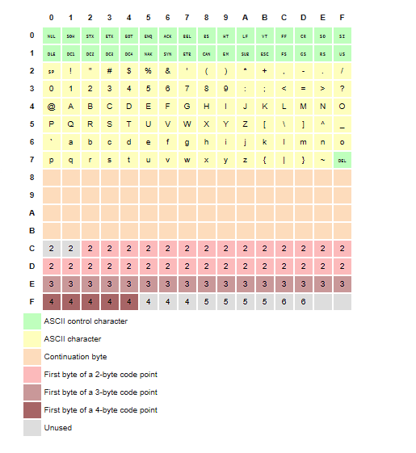

# Values, Types and operators

- To be able to work with hugh quantities of bits without getting lost
  we must separate them into chuncks that represent pieces of information.
- In JavaScript environment those chuncks are called **_values_**.
- Though all values are made of bits, they play different roles, every value has a \***\*type\*\***.

## Simple value types:

### NUMBERS

- JavaScript uses a fixed number of bits, 64 of them to store a single number value.
- The number of bits used (64) makes it limited to present numbers as 2<sup>64</sup>. which is 18 and 18 zeros after it.
- Those bits are also used to store negative numbers so one bit indicates the sign of the number.
- Some of these bits are used to present the decimal points.
- Since not all bits are used to represent numbers because some of them are used to present the sign and the decimal point then only 9 quadrillion is used (15 zeros) which is still pleasantly huge.
- for very big or very small numbers you may use scientific notation by adding an `e` (for exponent) -> 2.9998e8 = 2.998 x 10 <sup> 8 </sup> = 299,800,00.

- Calculations on integers smaller than the 9 quadrillion are guaranteed to be precise.
- Calculations on fractional numbers can't be precisely expressed by a finite number.

> [!IMPORTANT]
> Treat fractional numbers always as approximations not as a precise values.

### ARTHIMATIC OPERATIONS

- Arithmetic progression is followed in JavaScript 100 + 4 \* 11 means that the multiplication happens first.
- But as in mathematics you can change this by wrapping in parentheses (100 + 4 )\* 11.
- When operators appear together without parentheses, the order in which they are applied is determined by the precedence of the operators.
- The / operator has the same precedence as \*, Likewise + and -.

The arithmetic precedence in JavaScript is the same as in mathematics;
The order is

1. **Parentheses ()**
2. **Exponents \*\***
3. **Multiplication \*, Division /, and Remainder %**
4. **Addition + and Subtraction -**

```js
let result = 3 + 4 * 2 // is 11 not 14
```

```js
let result = (3 + 4) * 2 // is 14 not 11
```

### SPECIAL NUMBERS _(INFINITY, -INFINITY, NaN)_

- There are three special values in JavaScript that are considered numbers but don't behave like normal numbers.

#### Fist two are:

- _`Infinity`_ & `-Infinity`.
- `Infinity - 1` is still _Infinity_\_
- don't put too much trust on Infinity based computations as it will quickly lead to NaN

#### The third \_(NaN):

- **NaN** stands for not a number even though it is a value of the number type.

```js
0 / 0 // NaN
```

```js
Infinity - Infinity // NaN
```

- Also any non meaningful results out of numeric operations will always be **NaN**.

### STRINGS

- You can use `''`, `""` or ` ``  `.
- Almost anything can be put between quotes and JavaScript will make a string value out of it.
- Few Characters are hard to put between quotes. like __quotes__, __Newlines__ can only be included without escaping by adding `\`.
- whenever a backslash (`\`) is found inside of quoted text it indicates that the character after it has special meaning, this is called **escaping** the character.
- `\n` is interpreted as a newline. -`\t` is interpreted as a tab character.


### "This is the first line\nAnd this is the second"

Output:
  ```
  This is the first line
  And this is the second
  ```
- If two backslashes follow each other , they will collapse together


### "A newline character is written like \\"\\n\\"."


Output:
 ```js
A newline character is written like "\n".
 ```
----

JavaScript represents strings based on Unicode standard so that strings can be saved as a series of bits to exist inside of computer.

<div align="center">

  
  <p>(ASCII MAP)</p>
</div>

---

JavaScript uses 16 bits (2 bytes) per string element describes up to
2 <sup> 16</sup>
= 65,536 of permutations of (00000000 00000000) different characters.

Unicode defines more characters than that (about twice) so it will not be enough to
represent every thing by one byte only we might need more around two or three bytes for
each in individual character.
.

> [!TIP]
> 1 bit = 2 values
> 2 <sup> n where n is the number of bits </sup>
>
> So 2-Bit = 2 \* 2 = 4 values => 4 permutations for binary values so we have
> 00, 01, 10, 11 =>
> 1, 2, 3, 4


> [!NOTE]
> **So each character in string is can be represented by 2 bytes (00000000 00000000)** > **But there are more characters in Unicode to represent such as emojies**

Example

1. Letter 'A' =

   - Decimal 65
   - Binary `01000001 00000000`

2. Emoji 👋

   - Decimal 128075
   - Binary `11011000 10111011 1101111 10011101` (two bytes of 16-bit sequence)

#### Sumary

- For Standard characters like 'A' or 'B'

  - They fit in a single 16-bit position, so their binary representation is straightforward

- For Emojis like 👋

  - They often require two 16-bit sequences.

```

const message = "Hi👋"; // The string has ab emoji

console.log(message.length) // Output: 4

```

> [!CAUTION]
> Because emoji takes two characters this can be complicated when using `length` depending on the string includes emojis or no.


### Notice that:
 The `+` operator doesn't add Strings it **concatenates** strings.

 ----

\` \` are called *template literals* and anything inside of them is converted to string

if ${} added inside template literals any JavaScript code can be executed.

```js
`half of 100 os ${100 / 2}`
```

Output: `half of 100 is 50 `

### UNARY OPERATORS

#### typeof operator

Produces a string value naming the type of the value you give

```js
console.log(typeof 4.5 );
// -> number
console.log(typeof "x");
// -> string

console.log(typeof NaN);
// -> number
```

>[!NOTE]
> The minus operator can be use both as *unary* and *binary*.

```js
console.log(- (10 - 2));
// -> -8
```


### BOOLEAN VALUES

JavaScript has a *Boolean* type which has two values `true`, `false`

#### COMPARISON

- The way strings are ordered is roughly alphabetical.

- Uppercase letters are always less than lowercase.
- Non-alphabetic characters `(!, -, and so on ...)` are included in the ordering
- When comparing string JavaScript goes from left to right comparing the Unicode codes one by one


>[!NOTE]
> In JavaScript you can compare between strings using operators, this behavior is not correct in languages like Java.

```java
  // To Compare between String in java
  String str1 = new String("");
  String str2 = new String("");

  Str1.equals(Str2);
```
since using operators in java will simply compare references of the two strings as string in java is non- primitive data type.

```js
  // To compare between String in JavaScript
  console.log("Itchy" != "Scratchy");
  // -> true
  console.log("Apple" == "Orange");
  // -> false
```

>[!IMPORTANT]
> There's only one value in JavaScript that is not equal to itself which is NaN;

  ```js
  console.log(NaN == NaN);
  // -> false
  ```


### LOGICAL OPERATORS


JavaScript supports 3 logical operators `&&` = *and*, `||`= *or* and `!` = *not*.

#### Precedence

1. Parentheses `()`
2. Logical NOT `!`
3. Logical AND `&&`
4. Logical OR `||`
5. Conditional operator `? :`

```js
  let a = true, b = false, c = true;
  let result = a || b && !c;
  // Precedence order:
  // 1. !c -> false
  // 2. b && !c -> false
  // 3. a || (b && !c) -> true

  console.log(result); // true
```

### EMPTY VALUES

1. `Null`
2. `undefined`

These are used to denote the absense of meaningful values.

- The difference in meaning between `undefined` `null` is an accident of JavaScript's design and it doesn't matter most of time.

